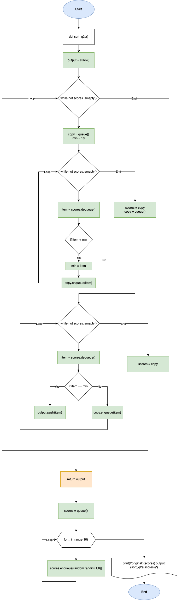

# Quiz 64

### Python Code

```.py
from random import randint


class Queue():
    def __init__(self):
        self.queue = []

    def enqueue(self, value):
        self.queue.append(value)

    def dequeue(self):
        if not self.queue:
            return 'None'
        else:
            return self.queue.pop(0)

    def empty(self):
        if not self.queue:
            return True
        else:
            return False

    def __repr__(self):
        output = ''
        for n in self.queue:
            output += str(n) + ' '
        return output[:-1]


class Stack():
    def __init__(self):
        self.stack = []

    def colored(self, r, g, b, text):
        return "\033[38;2;{};{};{}m{} \033[38;2;255;255;255m".format(r, g, b, text)

    def pop(self): # take the last value out
        output = self.stack[-1]
        self.stack = self.stack[:-1]
        return output

    def push(self, value): # insert value at the end
        self.stack.append(value)
        return self.stack

    def empty(self): # check if list is empty
        return self.stack == []

    def __repr__(self):
        output = ''
        for text in self.stack:
            output += str(text) + ' '
        return output[:-1]


'''Function to turn a queue into a descending sorted stack'''
def sort_queue2stack(scores):
    output = Stack()
    while not scores.empty():  # repeat until original input is empty (all scores have been taken out)
        backup = Queue()
        min = 10
        while not scores.empty():  # find the minimum
            item = scores.dequeue()  # take an element out of input
            if item < min:  # change the minimum if the item is less than the minimum
                min = item
            backup.enqueue(item)  # add element to stack
        scores = backup  # scores becomes a queue missing the taken out element
        backup = Queue()  # recycle backup as an empty queue

        while not scores.empty():
            item = scores.dequeue()  # cycle through scores to check each element
            if item == min:  # compare with minimum, push to output stack if correct
                output.push(item)
            else:
                backup.enqueue(item)
        scores = backup
    return output


scores = Queue()
for i in range(10):
    scores.enqueue(randint(1,7))

print(f"Original: {scores}, Output: {sort_queue2stack(scores)}")
```

### Test


### Flow diagram


